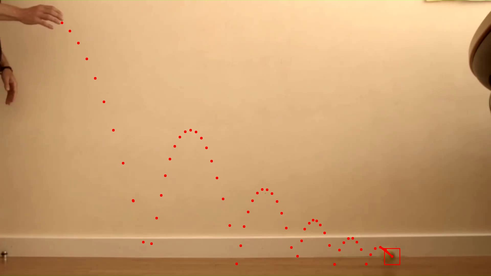

# Python Tracker

El programa se enfoca en realizar el seguimiento de un elemento en un archivo de video para poder trazar su trayectoria y hacer una estimación de la velocidad, utilizando plantillas y algoritmos de Opencv.

Programa desarrollado durante la estadía del servicio social en el <a href="http://investigacion.cucei.udg.mx/laboratorios/laboratorio/sistemas-inteligentes">Laboratorio de Sistemas Inteligentes</a> del Centro Universitario de Ciencias Exactas e Ingenierías.

# Manual de Usuario

<a href="https://github.com/JESG-27/Python-Tracker/blob/main/Manual Python Tracker.pdf">Ver manual</a>

# Ejemplo

